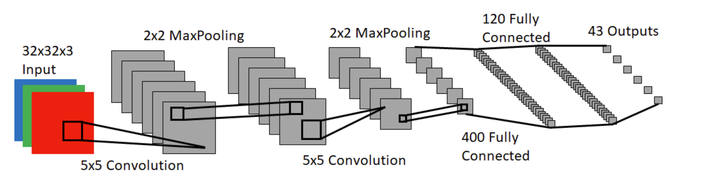

# Traffic-Sign-Classifier

## Description:
The objective of this project was to build a neural network to classify the Traffic Signs for an autonomous vehicle. Our network was inspired from the LeNet architecture as shown in the below 

## Dataset Used:
We made use of the German Traffic Sign  Detection Benchmark (GTSDB). More information about the dataset can be found [here.](http://benchmark.ini.rub.de/?section=gtsrb&subsection=dataset)

## What you will need to run:
* Python 3.6+
* Pandas : `pip install pandas`
* Numpy : `pip install numpy`
* OpenCV : `pip install opencv-contrib-python`
* Matplotlib : `pip install matplotlib`
* Pytorch : \
If your code is running on CPU: `pip install torch==1.6.0+cpu torchvision==0.7.0+cpu -f https://download.pytorch.org/whl/torch\_stable.html` \
If your code is running on GPU: `pip install torch==1.6.0+cu101 torchvision==0.7.0+cu101 -f https://download.pytorch.org/whl/torch\_stable.html`

## How to run:
Clone this repository and run traffic_sign_classifier.ipynb in jupyter notebook

## Team Members 
* Willam Sweeten 
* Orlando Moreno
* Anusha Vaidya 
